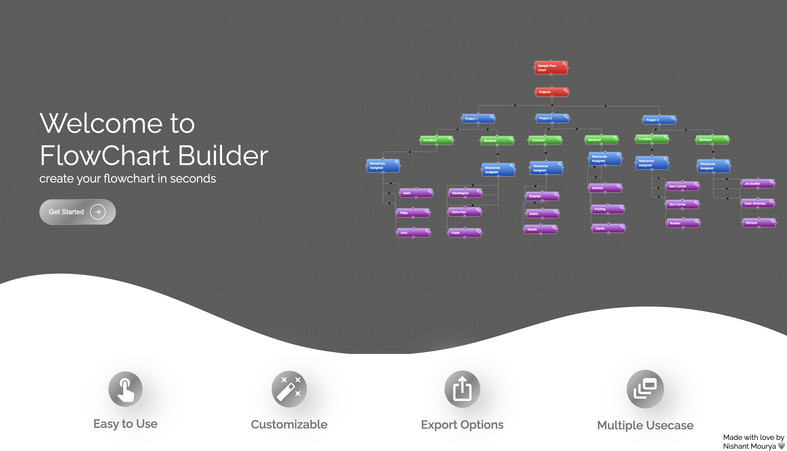

# 🚀 FlowChartBuilder

FlowChartBuilder is a fully responsive, easy-to-use web application built with **Vite**, **ReactJS**, and **JavaScript**. It allows users to create, customize, and manage flowcharts directly in the browser with seamless support for multiple devices.

 <!-- Add an actual screenshot file named 'screenshot.png' in your repo -->

## ✨ Features

- ⚡ Built with **Vite** for fast development and optimized builds
- 🧠 **React Flow** integration for intuitive and customizable flowchart creation
- 🎨 **Styled Components** for responsive and clean UI design
- 💾 Uses **LocalStorage** for quick and persistent data access
- 📸 Capture flowcharts as images using **dom-to-image**
- 🔄 Import and export flowcharts easily
- 📱 Fully responsive design compatible with **multiple devices**
- 🧩 Clean and intuitive user interface — perfect for all skill levels

## 🛠️ Getting Started

Follow these steps to clone and run the project on your local system:

### 1. Clone the Repository

```bash
git clone https://github.com/your-username/FlowChartBuilder.git
cd FlowChartBuilder
```
### 2. Install Dependencies

```bash
npm install
```
### 3. Run the Development Server
```bash
npm run dev
```
### Visit http://localhost:5173 in your browser to view the app.
### 4. Build for Production
```bash
npm run build
```
## 📦 Dependencies
- ReactJS
- React Flow
- Styled Components
- dom-to-image
- Vite
- NeuMorphism, Universe.io for animated loaders and  Buttons
- Animate.css for animations

 ## ❤️ Made with love by Nishant Mourya

---
### ✅ Notes:

- Replace `your-username` with your actual GitHub username.


